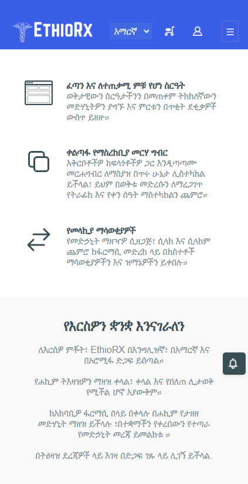
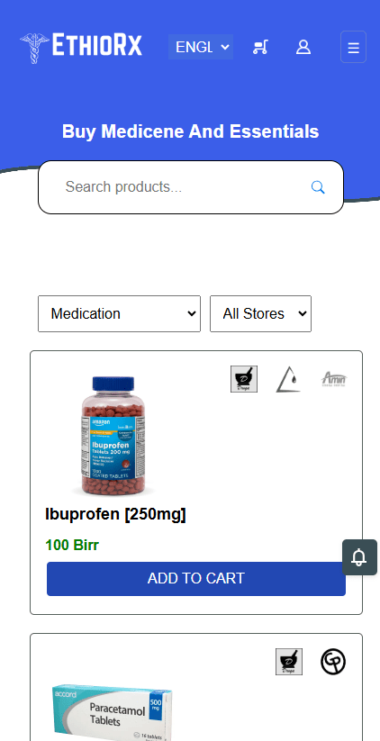
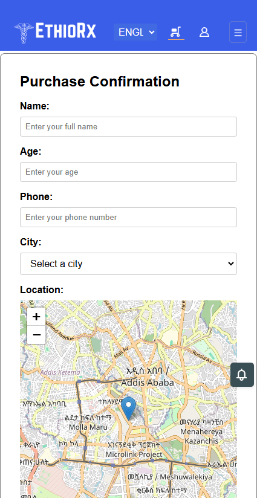

<div align="center">
  <a href="https://saikyo0.github.io/ethiorx">
    
  </a>
  <h2>EthioRX</h2>
  <p align="center">
    <p>Premier Platform for Accessing Medications in Ethiopia</p>
  </p>
</div>

<div align="center">
  <a href="https://saikyo0.github.io/ethiorx">Live Demo</a>
</div>

## EthioRX

Welcome to EthioRX Online Pharmacy, the premier platform for accessing prescription and over-the-counter medications with ease and speed throughout Ethiopia. 🇪🇹

### Motivation

In Ethiopia, accessing medications quickly and securely can be a challenge. EthioRX aims to bridge that gap, providing a streamlined way for customers across the country to order medications from the comfort of their homes. With cutting-edge technology and a vast network of trusted partners, we're transforming how healthcare products are delivered.

### Key Features

- **User-Friendly Interface**: Easily navigate and find the medications you need with our intuitive platform.
- **Real-Time Tracking**: Track your orders from start to finish with up-to-date delivery information.
- **Nationwide Delivery**: We deliver to both urban and rural areas across Ethiopia, ensuring that no one is left behind.
- **Multilingual Support**: Our platform is available in English, Amharic, and Oromiffa, with dedicated customer support in multiple languages.
- **Secure Payments**: Enjoy safe and encrypted payment options for your transactions.

<details open>

<summary>More</summary>
  
  
  
  
</details>

### Under the Hood

- [**HTML**](): A fast and lightweight build tool designed to streamline development for modern web projects.
- [**CSS**](): A powerful JavaScript library for building interactive user interfaces, ensuring a smooth and responsive web experience.
- [**JS**](): A React-based framework that supports server-side rendering and static site generation, optimizing both performance and SEO.

### Payments

<details open>
<summary>More</summary>
   <br />  
  
</details>

## Production Setup

### Managed Hosting

You can try [Vercel](https://vercel.com), a simple, user-friendly, and sophisticated platform to host your Next.js applications with ease.

It takes care of deployment, scaling, and performance optimization, allowing you to focus on building your application.

<div>
  <a href="https://vercel.com" target="_blank">
    <picture>
      <source media="(prefers-color-scheme: dark)" srcset="https://vercel.com/logo-dark.png">
      
    </picture>
  </a>
</div>

### Self-Hosted
#### Docker

Prerequisites: docker, docker-compose, git. Refer to [Docker Documentation](https://docs.docker.com) for more details on Docker setup.

Run the following commands:

```bash
git clone https://github.com/saikyo0/ethiorx
cd ethiorx
docker-compose up -d
```

After a couple of minutes, the site should be accessible on your localhost port: 3000.

## Development Setup

### Manual Install

To set up the repository locally, follow the steps mentioned below:

1. Clone the repository:
   ```bash
   git clone https://github.com/saikyo0/ethiorx
   cd ethiorx
   ```

2. Install dependencies:
   ```bash
   npm install
   ```

3. Start the development server:
   ```bash
   npm run dev
   ```

4. Open the URL `http://localhost:3000` in your browser, and you should see the application running.

<br />
<br />
<div align="center" style="padding-top: 0.75rem;">
  <a href="https://your-website.com" target="_blank">
    <picture>
      <source media="(prefers-color-scheme: dark)" srcset="./resources/images/logos/EthioRX.png">
      
    </picture>
  </a>
</div>
